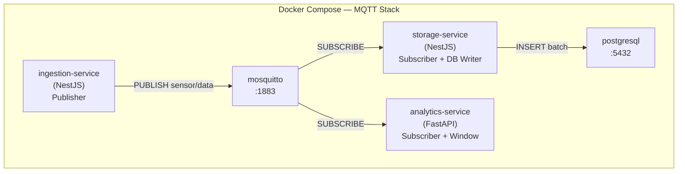
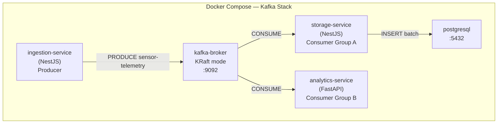
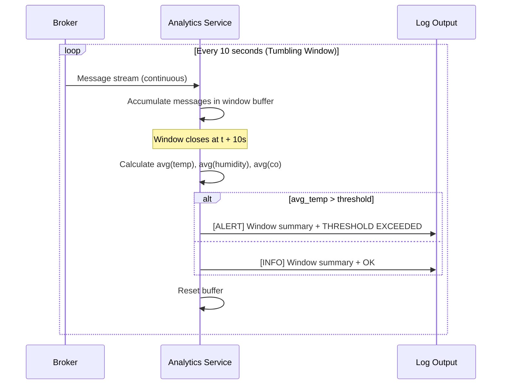
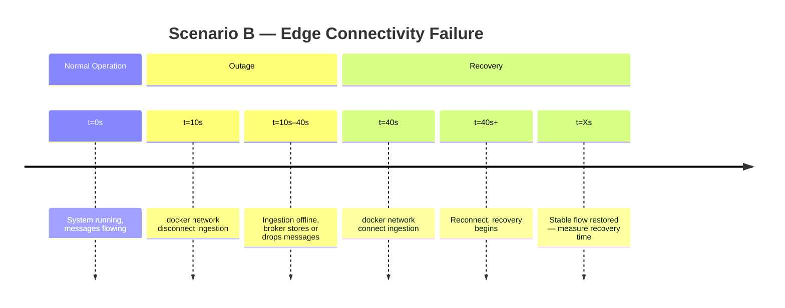

# DECISIONS.md
# Architecture & Technology Decisions — IoTS Project 2

> **Purpose:** Documents all key technology choices, trade-off analyses, and scope decisions made during project planning. This is the "why" document — REQUIREMENTS.md is the "what" document. Reference this when a code agent needs justification for a particular approach.

---

## Table of Contents

1. [Tech Stack Decision: Second Technology](#1-tech-stack-decision-second-technology)
2. [Service-to-Technology Mapping](#2-service-to-technology-mapping)
3. [Frontend Analysis: React Dashboard](#3-frontend-analysis-react-dashboard)
4. [Broker Deployment Decisions](#4-broker-deployment-decisions)
5. [Architecture Diagrams](#5-architecture-diagrams)
6. [Out of Scope](#6-out-of-scope)
7. [Refinements — Implementation Planning Session](#7-refinements--implementation-planning-session)

---

## 1. Tech Stack Decision: Second Technology

### Requirement

The project specification mandates **at least two different backend technologies**. NestJS (TypeScript/Node.js) is the primary choice based on team experience.

### Candidates Evaluated

| Candidate     | Strengths for this project                              | Weaknesses                                         |
|---------------|---------------------------------------------------------|----------------------------------------------------|
| **FastAPI**   | Asyncio native, `aiokafka`/`asyncio-mqtt`, Python `statistics` stdlib, lightweight container, ideal for stream processing | Slower cold start than Node.js; Python GIL limits true parallelism |
| **.NET Core** | High throughput, strong typing, mature ecosystem, excellent Kafka client (`Confluent.Kafka`) | Heavy JVM-like overhead, larger container images, more setup for a 1-service use case |

### ✅ Decision: FastAPI (Python)

**Rationale:**

1. **The Analytics Service is the natural fit.** It performs continuous stream processing with statistical calculations (rolling averages, threshold comparisons) — Python's `statistics`, `collections`, and `datetime` modules handle this with zero dependencies.

2. **Async-first without extra configuration.** `asyncio-mqtt` and `aiokafka` both integrate natively with FastAPI's `asynccontextmanager` lifecycle, making subscription loops clean and idiomatic.

3. **No shared code between services.** Since Ingestion and Storage stay in NestJS, FastAPI only needs to implement one service — no large framework needs to be bootstrapped for enterprise-scale concerns.

4. **Lighter containers.** A Python FastAPI container with `asyncio-mqtt`/`aiokafka` is ~200–400MB. A .NET Core container starts at ~300MB before any code.

5. **Python is academically expected.** In an IoT/data course context, having Python do the analytics component aligns with typical academic expectations.

> **.NET would be preferred if:** there were multiple high-throughput services requiring maximum concurrency control, a shared domain model, or the team had more .NET experience than Python.

---

## 2. Service-to-Technology Mapping

### Final Assignment

```
┌─────────────────────────────────────────────────────────┐
│                     NestJS (TypeScript)                 │
│                                                         │
│  ┌─────────────────────────┐  ┌──────────────────────┐ │
│  │   Data Ingestion Svc    │  │  Data Storage Svc    │ │
│  │                         │  │                      │ │
│  │  • MQTT.js publisher    │  │  • MQTT.js subscriber│ │
│  │  • KafkaJS producer     │  │  • KafkaJS consumer  │ │
│  │  • Device simulator     │  │  • TypeORM / pg      │ │
│  │  • Burst mode support   │  │  • Batch write mode  │ │
│  └─────────────────────────┘  └──────────────────────┘ │
└─────────────────────────────────────────────────────────┘

┌─────────────────────────────────────────────────────────┐
│                   FastAPI (Python)                      │
│                                                         │
│  ┌──────────────────────────────────────────────────┐  │
│  │               Analytics Service                  │  │
│  │                                                  │  │
│  │  • asyncio-mqtt / aiokafka subscriber            │  │
│  │  • Tumbling Window (10s) accumulator             │  │
│  │  • Average temp/humidity/co per window           │  │
│  │  • Threshold-based alert logging                 │  │
│  │  • Latency timestamp embedding (Scenario D)      │  │
│  └──────────────────────────────────────────────────┘  │
└─────────────────────────────────────────────────────────┘
```

### Why Not Split by Broker?

An alternative was considered: NestJS handles all MQTT services, FastAPI handles all Kafka services. This was rejected because:

- It would require duplicating the Storage Service logic in Python unnecessarily
- PostgreSQL writes are not analytically interesting — they are pure I/O
- The cleanest narrative is **NestJS = data transport layer**, **FastAPI = analytics layer**
- Both technologies then work with both brokers, which is more informative for the comparison

---

## 3. Frontend Analysis: React Dashboard

### Proposed Stack

| Layer      | Technology                                                |
|------------|-----------------------------------------------------------|
| Framework  | React 18 + Vite                                           |
| UI         | shadcn/ui + Tailwind CSS                                  |
| Data fetch | TanStack Query (React Query)                              |
| Tables     | TanStack Table                                            |
| Charts     | Recharts (or chart.js)                                    |
| Real-time  | WebSocket or SSE from NestJS API Gateway                  |

### What the Dashboard Would Show

```
┌──────────────────────────────────────────────────┐
│              IoTS Project 2 Dashboard             │
├──────────────┬───────────────────────────────────┤
│  Scenario    │   Live Metrics                    │
│  Controls    │                                   │
│              │   [Throughput Chart — real time]  │
│  [Run A]     │   MQTT ──── Kafka                 │
│  [Run B]     │                                   │
│  [Run C]     ├───────────────────────────────────┤
│  [Run D]     │   Alert Feed                      │
│              │   > [ALERT] 10:23:45 | Temp 63°F  │
│  Broker:     │   > [INFO]  10:23:35 | Temp 48°F  │
│  ◉ MQTT      │                                   │
│  ○ Kafka     ├───────────────────────────────────┤
│              │   Results Table (filled after run)│
│  QoS / acks  │   | Config | Throughput | p95 |   │
│  [ 0 ]       │                                   │
└──────────────┴───────────────────────────────────┘
```

### Complexity Estimate

| Component                          | Effort     | Notes                                               |
|------------------------------------|------------|-----------------------------------------------------|
| NestJS API Gateway (REST + WS)     | 1–2 days   | New service exposing metrics endpoint and WS hub    |
| Scenario trigger endpoints         | 0.5 days   | REST endpoints that shell-exec benchmark scripts    |
| React app scaffold + routing       | 0.5 days   | Vite + shadcn + Tailwind setup                      |
| Live throughput chart (Recharts)   | 1 day      | WebSocket → state → chart                           |
| Alert feed component               | 0.5 days   | SSE or WS subscription                              |
| Results table (TanStack Table)     | 0.5 days   | Static after scenario run                           |
| **Total**                          | **~4–5 days** | Assuming familiarity with the stack               |

### Verdict

**✅ Recommended — implement as a separate, clearly bounded module.**

**Why it's worth it:**

1. **Demonstration value.** A dashboard makes the project significantly more impressive during academic presentation. Visual side-by-side MQTT vs. Kafka throughput charts convey the comparison instantly.

2. **Triggering convenience.** Running scenario scripts manually via CLI is tedious. A UI with one-click scenario launch improves iteration speed during development.

3. **Scope containment.** If scoped correctly (a thin `dashboard-service` + React SPA), it does not touch any core benchmark logic. All measurements remain script-based — the frontend only displays results.

**⚠️ Constraints:**

- The dashboard **must not** become a prerequisite for running benchmarks. All scenarios must remain executable via standalone shell scripts without the frontend running.
- The performance table data must still be collected from `docker stats` and dedicated benchmark tools — the dashboard only visualizes it, not replaces it.
- Dashboard is labeled explicitly in the repo as `OPTIONAL` and must be the **last thing implemented** after all scenario tests pass.

### Implementation Strategy

```
dashboard/
├── api-gateway/           ← NestJS service
│   ├── src/
│   │   ├── scenarios/     ← endpoints: POST /scenarios/a, /b, /c, /d
│   │   ├── metrics/       ← WebSocket gateway streaming docker stats
│   │   └── alerts/        ← SSE feed from Analytics Service logs
│   └── Dockerfile
└── ui/                    ← React + Vite SPA
    ├── src/
    │   ├── components/    ← shadcn/ui components
    │   ├── pages/         ← Dashboard, Results, Alerts
    │   └── hooks/         ← useWebSocket, useScenario, useTanStackQuery
    └── Dockerfile
```

---

## 4. Broker Deployment Decisions

### MQTT — Mosquitto Configuration Notes

- Use **Eclipse Mosquitto** (official Docker image: `eclipse-mosquitto`)
- Mount `mosquitto.conf` as a volume
- Expose port `1883` (MQTT) and optionally `9001` (WebSocket for browser clients)
- For Scenario B: ensure the Ingestion Service uses **persistent sessions** (`cleanSession = false`) so the test is meaningful
- QoS level should be injected via env var, not hardcoded, to allow switching without rebuilding

### Kafka — KRaft Configuration Notes

- Use `confluentinc/cp-kafka` or `apache/kafka` image with KRaft enabled
- No ZooKeeper container — this is mandatory per spec (resource constraint)
- Set `KAFKA_NODE_ID`, `KAFKA_PROCESS_ROLES=broker,controller`, `KAFKA_CONTROLLER_QUORUM_VOTERS`
- Start with **1 partition** for baseline, test with **3 and 6 partitions** for Scenario A scale tests
- `acks` setting must be configurable per producer instance (env var injection)

---

## 5. Architecture Diagrams

### Full Docker Compose Stack (MQTT Variant)



### Full Docker Compose Stack (Kafka Variant)



### Tumbling Window Logic (Analytics Service)



### Scenario B — Network Failure Timeline



---

## 6. Out of Scope

The following items are **explicitly out of scope** for this project:

| Item                        | Reason                                                          |
|-----------------------------|-----------------------------------------------------------------|
| Authentication/Authorization| Not required by spec; adds complexity without academic value   |
| HTTPS/TLS for brokers       | Local Docker network; plain TCP is sufficient for benchmarking |
| Multiple Kafka replicas     | KRaft single-node is sufficient; replication adds local RAM cost|
| Real physical IoT hardware  | Dataset-based simulation is specified by the project           |
| Cloud deployment            | All experiments run locally via Docker Compose                 |
| GraphQL API                 | Not required; REST-only for dashboard API gateway              |
| Message schema validation   | JSON parsing sufficient; Avro/Protobuf adds unnecessary complexity |

---

## 7. Refinements — Implementation Planning Session

These decisions were made when turning the brainstorm into an executable plan (see [PLAN.md](PLAN.md)). They refine — and in one case override — the earlier drafts.

### 7.1 Unified repository structure (overrides duplicated `mqtt/`+`kafka/` trees)

**Decision:** One codebase per service, not one per broker. Each service defines a `BrokerAdapter` interface; `MqttAdapter` (mqtt.js / asyncio-mqtt) and `KafkaAdapter` (kafkajs / aiokafka) implement it; the concrete adapter is chosen at runtime from `BROKER_TYPE`. Docker Compose **profiles** (`mqtt` | `kafka`) decide which broker stack runs.

**Why:** The original [REQUIREMENTS.md](REQUIREMENTS.md) §11 showed full per-broker copies of every service — literal code duplication, the one risk flagged during brainstorming. The adapter pattern removes it entirely: business logic (simulator, batch writer, tumbling window) never references the broker; switching is one CLI flag with no code change. The two NestJS services additionally share `services/libs/broker` + `services/libs/contracts` via npm workspaces, so even the adapter code exists once. FastAPI re-implements the adapter in Python — different language, so this is necessary parity, not duplication; it mirrors the contract documented in `shared/message-contract.md`.

### 7.2 Load-generation split (bench tools vs simulator)

**Decision:** Use the mandated bench tools (emqtt-bench / kafka-producer-perf-test) for **raw throughput** scenarios (A massive ingestion, C burst); use the **NestJS simulator** for scenarios needing realistic, addressable, timestamp-embedded messages — **B** (the thing being disconnected) and **D** (latency).

**Why:** The spec says "do not write custom load generators" for performance testing, yet also requires a configurable device simulator. They serve different goals: bench tools push maximum volume to find the broker's ceiling; the simulator produces correlated messages (`seq`, `sent_at_ms`, real device IDs) that B and D measurement depends on. Bench tools can't easily embed a custom send timestamp for latency. Splitting by scenario honors both requirements.

### 7.3 Measurement enrichment: `seq` + `sent_at_ms` + dual latency

**Decision:** Extend the payload with `seq` (per-device monotonic counter) and `sent_at_ms` (wall-clock send time). Analytics records a per-message receive timestamp and reports **two** latencies: transport (`receive − sent_at_ms`) and event-to-alert (`alert_log − sent_at_ms`).

**Why:** Without a per-device sequence, loss/duplicate rates can only be inferred from gross counts; `seq` makes gap/duplicate detection exact (critical for QoS 1 / acks=1 analysis). The spec's single latency metric (alert log time) bakes in up to `WINDOW_SIZE_SEC` of tumbling-window buffering, so it doesn't isolate broker delivery time — transport latency does. "Extension of attributes is allowed" (REQUIREMENTS §1) explicitly permits these fields. This **does not** reverse the "no schema validation / no Avro/Protobuf" out-of-scope decision (§6) — these are plain JSON fields, not a schema layer.

### 7.4 TimescaleDB hypertable, composite PK `(ts, device)`

**Decision:** Use TimescaleDB (PostgreSQL + time-series extension); `sensor_data` is a hypertable partitioned on `ts` with primary key `(ts, device)`. Schema is created by `docker/db/init.sql`; Storage runs TypeORM with `synchronize: false`.

**Why:** `ts` alone cannot be the primary key — the three devices can emit the same `ts`, so it would collide. `(ts, device)` is unique and, conveniently, TimescaleDB *requires* the partitioning column in any unique key. The hypertable keeps high-rate inserts (Scenarios A/C) and `ts`-range queries fast and adds `time_bucket()` for post-run analysis, at the cost of one drop-in image swap (it speaks the Postgres wire protocol, so the `pg` driver is unchanged). Plain Postgres with a surrogate id was the alternative; TimescaleDB was chosen for the time-series fit. This stays within §6 scope (single-node, no replication).

### 7.5 Batch flush on size OR time; WSL2 dev environment

**Decisions:** (a) The Storage batch writer flushes when `BATCH_SIZE` is reached **or** `FLUSH_INTERVAL_MS` elapses — whichever first. (b) Development happens in **WSL2** + Docker Desktop.

**Why:** (a) A size-only batch stalls at low rates (Scenario D, idle gaps) and makes loss-on-crash unbounded; a time trigger bounds both. (b) The mandated bench tools (emqtt-bench is Erlang; k6 broker extensions are Go/xk6) and the `.sh` scripts are Linux-native — running them in WSL2 avoids win32 friction without containerizing the tools just for the host OS.

### 7.6 Dev-mode observability tooling (Kafka UI + MQTT Explorer)

**Decision:** Add dev-only broker inspection tools, kept off the benchmark path. (a) **Kafka UI** (`ghcr.io/kafbat/kafka-ui`) as a compose service behind a dedicated **`tools`** profile — view topics, partitions, consumer groups, messages, offsets, lag at `http://localhost:8080`. (b) **MQTT Explorer** (external desktop app) for MQTT, connecting to `localhost:1883` — no container by design. See [notes/02-dev-tooling.md](notes/02-dev-tooling.md).

**Why:** During development we need to *see* broker state — without it, debugging delivery/lag in Scenarios A–D is guesswork. Kafka UI is gated behind its own `tools` profile (not the `kafka` profile) so normal/benchmark runs bring up only the broker and the UI never competes for resources during measured runs — measurement integrity over convenience. MQTT's best inspector (MQTT Explorer) is a desktop app that connects fine over the WSL2↔Windows localhost boundary, so containerizing it would add nothing; Mosquitto already exposes WS on 9001 for any browser client as a fallback. `kafbat/kafka-ui` is the actively-maintained fork of the archived `provectus/kafka-ui`. These tools are dev/diagnostic only — they don't change any service code or the message contract, and stay within §6 single-node scope.

---

*Last updated: June 2026 — §7.1–7.5 implementation-planning refinements; §7.6 dev-mode tooling.*