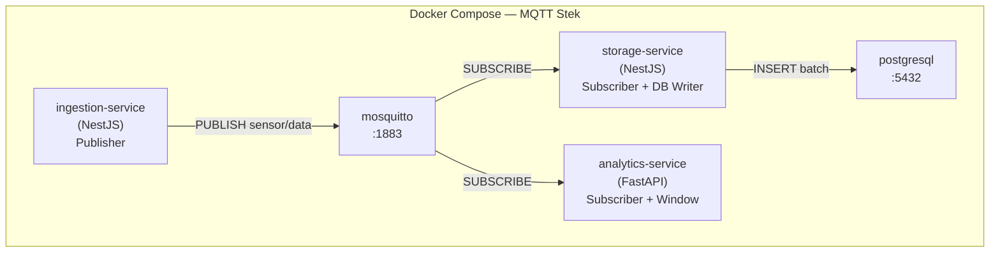
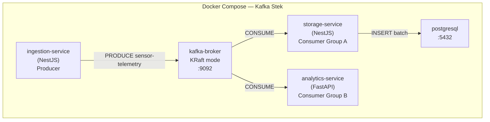
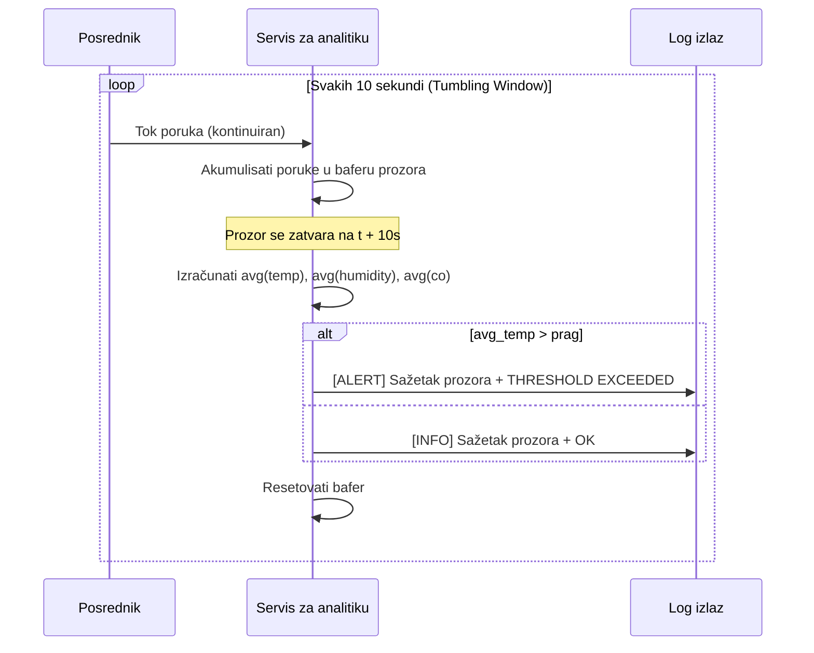
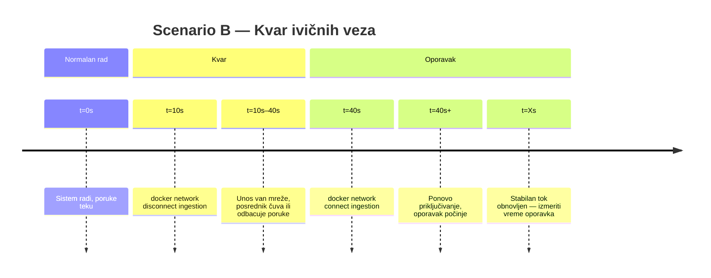

# ODLUKE.md
# Arhitekturne i tehnološke odluke — IoTS Projekat 2

> **Svrha:** Dokumentuje sve ključne tehnološke izbore, analize kompromisa i odluke o obimu donete tokom planiranja projekta. Ovo je dokument "zašto" — ZAHTEVI.md je dokument "šta". Referisati ovde kada agent koda treba opravdanje za određeni pristup.

---

## Sadržaj

1. [Odluka o tehnološkom steku: Druga tehnologija](#1-odluka-o-tehnoloskom-steku-druga-tehnologija)
2. [Mapiranje servisa na tehnologije](#2-mapiranje-servisa-na-tehnologije)
3. [Analiza frontend-a: React Dashboard](#3-analiza-frontend-a-react-dashboard)
4. [Odluke o postavljanju posrednika](#4-odluke-o-postavljanju-posrednika)
5. [Arhitekturni dijagrami](#5-arhitekturni-dijagrami)
6. [Van opsega](#6-van-opsega)
7. [Usavršavanja — Sesija planiranja implementacije](#7-usavrsavanja--sesija-planiranja-implementacije)

---

## 1. Odluka o tehnološkom steku: Druga tehnologija

### Zahtev

Specifikacija projekta zahteva **najmanje dve različite backend tehnologije**. NestJS (TypeScript/Node.js) je primarni izbor na osnovu iskustva tima.

### Evaluirani kandidati

| Kandidat      | Prednosti za ovaj projekat                                | Slabosti                                            |
|---------------|-----------------------------------------------------------|-----------------------------------------------------|
| **FastAPI**   | Asyncio native, `aiokafka`/`asyncio-mqtt`, Python `statistics` stdlib, lagan kontejner, idealan za obradu tokova | Sporiji cold start od Node.js; Python GIL ograničava pravo paralelizam |
| **.NET Core** | Visoki protok, strogo tipiziranje, zreli ekosistem, odličan Kafka klijent (`Confluent.Kafka`) | JVM-slični overhead, veće slike kontejnera, više postavljanja za jedan servis |

### ✅ Odluka: FastAPI (Python)

**Obrazloženje:**

1. **Servis za analitiku je prirodna prilagodba.** Vrši kontinuiranu obradu tokova sa statističkim izračunima (klizne srednje vrednosti, poređenja praga) — Python-ovi `statistics`, `collections` i `datetime` moduli rešavaju ovo bez zavisnosti.

2. **Async-first bez dodatne konfiguracije.** `asyncio-mqtt` i `aiokafka` se oba nativno integrišu sa FastAPI-jevim `asynccontextmanager` lifecyclom, čineći petlje pretplate čistim i idiomatskim.

3. **Nema deljenog koda između servisa.** Pošto Unos i Skladištenje ostaju u NestJS-u, FastAPI treba da implementira samo jedan servis — nema potrebe za pokretanjem velikog okruženja.

4. **Lakši kontejneri.** Python FastAPI kontejner sa `asyncio-mqtt`/`aiokafka` je ~200–400MB. .NET Core kontejner počinje od ~300MB pre bilo kakvog koda.

5. **Python je akademski očekivan.** U kontekstu IoT/data kursa, Python za analitičku komponentu odgovara tipičnim akademskim očekivanjima.

> **.NET bi bio preferiran ako:** bi postojalo više high-throughput servisa koji zahtevaju maksimalnu kontrolu konkurentnosti, deljeni domenski model, ili tim ima više .NET iskustva nego Python iskustva.

---

## 2. Mapiranje servisa na tehnologije

### Finalna dodela

```
┌─────────────────────────────────────────────────────────┐
│                     NestJS (TypeScript)                 │
│                                                         │
│  ┌─────────────────────────┐  ┌──────────────────────┐ │
│  │   Servis za unos        │  │  Servis za sklad.    │ │
│  │                         │  │                      │ │
│  │  • MQTT.js publisher    │  │  • MQTT.js subscriber│ │
│  │  • KafkaJS producer     │  │  • KafkaJS consumer  │ │
│  │  • Device simulator     │  │  • TypeORM / pg      │ │
│  │  • Burst mode podrška   │  │  • Batch write mode  │ │
│  └─────────────────────────┘  └──────────────────────┘ │
└─────────────────────────────────────────────────────────┘

┌─────────────────────────────────────────────────────────┐
│                   FastAPI (Python)                      │
│                                                         │
│  ┌──────────────────────────────────────────────────┐  │
│  │               Servis za analitiku                │  │
│  │                                                  │  │
│  │  • asyncio-mqtt / aiokafka subscriber            │  │
│  │  • Tumbling Window (10s) akumulator              │  │
│  │  • Prosečna temp/vlažnost/co po prozoru          │  │
│  │  • Logovanje upozorenja na osnovu praga          │  │
│  │  • Ugrađivanje vremenskog pečata (Scenario D)    │  │
│  └──────────────────────────────────────────────────┘  │
└─────────────────────────────────────────────────────────┘
```

### Zašto ne podeliti po posredniku?

Razmatrana je alternativa: NestJS rukuje svim MQTT servisima, FastAPI rukuje svim Kafka servisima. Ovo je odbijeno jer:

- Zahtevalo bi nepotrebno dupliciranje logike Servisa za skladištenje u Python-u
- PostgreSQL upisi nisu analitički interesantni — čisti su I/O
- Najčistija priča je **NestJS = sloj transporta podataka**, **FastAPI = analitički sloj**
- Obe tehnologije tada rade sa oba posrednika, što je informativnije za poređenje

---

## 3. Analiza frontend-a: React Dashboard

### Predloženi stek

| Sloj          | Tehnologija                                               |
|---------------|-----------------------------------------------------------|
| Okruženje     | React 18 + Vite                                           |
| UI            | shadcn/ui + Tailwind CSS                                  |
| Fetch podataka | TanStack Query (React Query)                             |
| Tabele        | TanStack Table                                            |
| Grafikoni     | Recharts (ili chart.js)                                   |
| Real-time     | WebSocket ili SSE iz NestJS API Gateway-a                 |

### Šta bi Dashboard prikazivao

```
┌──────────────────────────────────────────────────┐
│              IoTS Projekat 2 Dashboard            │
├──────────────┬───────────────────────────────────┤
│  Kontrole    │   Live metrike                    │
│  scenarija   │                                   │
│              │   [Grafikon protoka — real time]  │
│  [Pokreni A] │   MQTT ──── Kafka                 │
│  [Pokreni B] │                                   │
│  [Pokreni C] ├───────────────────────────────────┤
│  [Pokreni D] │   Feed upozorenja                 │
│              │   > [ALERT] 10:23:45 | Temp 63°F  │
│  Posrednik:  │   > [INFO]  10:23:35 | Temp 48°F  │
│  ◉ MQTT      │                                   │
│  ○ Kafka     ├───────────────────────────────────┤
│              │   Tabela rezultata (posle pokr.)  │
│  QoS / acks  │   | Config | Propusnost | p95 |   │
│  [ 0 ]       │                                   │
└──────────────┴───────────────────────────────────┘
```

### Procena složenosti

| Komponenta                           | Napor     | Napomene                                              |
|--------------------------------------|-----------|-------------------------------------------------------|
| NestJS API Gateway (REST + WS)       | 1–2 dana  | Novi servis koji izlaže metrike i WS hub              |
| Endpoint-ovi za pokretanje scenarija | 0,5 dana  | REST endpoint-ovi koji shell-exec benchmark skriptama |
| Scaffold React aplikacije + routing  | 0,5 dana  | Vite + shadcn + Tailwind postavljanje                 |
| Live grafikon protoka (Recharts)     | 1 dan     | WebSocket → stanje → grafikon                         |
| Komponenta feed-a upozorenja         | 0,5 dana  | SSE ili WS pretplata                                  |
| Tabela rezultata (TanStack Table)    | 0,5 dana  | Statična posle pokretanja scenarija                   |
| **Ukupno**                           | **~4–5 dana** | Uz poznavanje steka                               |

### Zaključak

**✅ Preporučuje se — implementirati kao zaseban, jasno razgraničen modul.**

**Zašto vredi:**

1. **Demonstracijska vrednost.** Dashboard čini projekat značajno impresivnijim tokom akademske prezentacije. Vizuelni grafikon MQTT vs. Kafka protoka side-by-side prenosi poređenje odmah.

2. **Pogodnost pokretanja.** Ručno pokretanje scenario skripti putem CLI-ja je zamorno. UI sa jednim klikom za pokretanje scenarija poboljšava brzinu iteracija tokom razvoja.

3. **Ograničenje opsega.** Ako je ispravno opsegovan (tanak `dashboard-service` + React SPA), ne dira nikakvu logiku benchmark-a. Sva merenja ostaju skript-bazirana — frontend samo prikazuje rezultate.

**⚠️ Ograničenja:**

- Dashboard **ne sme** postati preduslov za pokretanje benchmark-ova. Svi scenariji moraju ostati izvršivi putem samostalnih shell skripti bez pokretanja frontend-a.
- Podaci tabele performansi moraju se i dalje prikupljati iz `docker stats` i namenskih benchmark alata — dashboard ih samo vizuelizuje, ne zamenjuje.
- Dashboard je eksplicitno označen u repozitorijumu kao `OPCIONALAN` i mora biti **poslednja stvar implementirana** nakon što svi testovi scenarija prođu.

### Strategija implementacije

```
dashboard/
├── api-gateway/           ← NestJS servis
│   ├── src/
│   │   ├── scenarios/     ← endpoint-ovi: POST /scenarios/a, /b, /c, /d
│   │   ├── metrics/       ← WebSocket gateway za streaming docker stats
│   │   └── alerts/        ← SSE feed iz logova Servisa za analitiku
│   └── Dockerfile
└── ui/                    ← React + Vite SPA
    ├── src/
    │   ├── components/    ← shadcn/ui komponente
    │   ├── pages/         ← Dashboard, Rezultati, Upozorenja
    │   └── hooks/         ← useWebSocket, useScenario, useTanStackQuery
    └── Dockerfile
```

---

## 4. Odluke o postavljanju posrednika

### MQTT — Napomene o konfiguraciji Mosquitto

- Koristiti **Eclipse Mosquitto** (zvanična Docker slika: `eclipse-mosquitto`)
- Montirati `mosquitto.conf` kao volumen
- Izložiti port `1883` (MQTT) i opcionalno `9001` (WebSocket za browser klijente)
- Za Scenario B: osigurati da Servis za unos koristi **trajne sesije** (`cleanSession = false`) kako bi test bio smislen
- QoS nivo treba ubaciti putem env promenljive, ne hardkodirati, kako bi se mogao menjati bez ponovnog izgradnje

### Kafka — Napomene o KRaft konfiguraciji

- Koristiti `confluentinc/cp-kafka` ili `apache/kafka` sliku sa omogućenim KRaft-om
- Bez ZooKeeper kontejnera — ovo je obavezno prema specifikaciji (ograničenje resursa)
- Podesiti `KAFKA_NODE_ID`, `KAFKA_PROCESS_ROLES=broker,controller`, `KAFKA_CONTROLLER_QUORUM_VOTERS`
- Početi sa **1 particijom** za baseline, testirati sa **3 i 6 particija** za Scenario A skaliranje
- `acks` podešavanje mora biti konfigurisabilno po instanci producenta (ubacivanje env promenljive)

---

## 5. Arhitekturni dijagrami

### Kompletan Docker Compose stek (MQTT varijanta)



### Kompletan Docker Compose stek (Kafka varijanta)



### Logika Tumbling Window (Servis za analitiku)



### Scenario B — Vremenski tok mrežnog kvara



---

## 6. Van opsega

Sledeće stavke su **eksplicitno van opsega** ovog projekta:

| Stavka                       | Razlog                                                             |
|------------------------------|--------------------------------------------------------------------|
| Autentikacija/Autorizacija   | Nije zahtevano spec-om; dodaje složenost bez akademske vrednosti   |
| HTTPS/TLS za posrednike      | Lokalna Docker mreža; plain TCP je dovoljan za benchmark           |
| Višestruke Kafka replike     | KRaft single-node je dovoljan; replikacija dodaje lokalni RAM trošak |
| Pravo fizičko IoT hardver    | Simulacija zasnovana na skupu podataka specificirana je projektom  |
| Cloud postavljanje           | Svi eksperimenti se pokreću lokalno putem Docker Compose           |
| GraphQL API                  | Nije zahtevano; samo REST za dashboard API gateway                 |
| Validacija sheme poruke      | JSON parsiranje je dovoljno; Avro/Protobuf dodaje nepotrebnu složenost |

---

## 7. Usavršavanja — Sesija planiranja implementacije

Ove odluke su donete kada je brainstorming pretvoren u izvodljiv plan (vidi [PLAN.md](../PLAN.md)). Usavršavaju — a u jednom slučaju prepisuju — ranije verzije.

### 7.1 Unifikovan raspored repozitorijuma (prepisuje duplicirana `mqtt/`+`kafka/` stabla)

**Odluka:** Jedna kodna baza po servisu, ne jedna po posredniku. Svaki servis definiše `BrokerAdapter` interfejs; `MqttAdapter` (mqtt.js / asyncio-mqtt) i `KafkaAdapter` (kafkajs / aiokafka) ga implementiraju; konkretan adapter se bira pri pokretanju iz `BROKER_TYPE`. Docker Compose **profili** (`mqtt` | `kafka`) odlučuju koji stek posrednika radi.

**Zašto:** Originalni [ZAHTEVI.md](ZAHTEVI.md) §11 pokazivao je pune kopije po posredniku svakog servisa — bukvalna duplikacija koda, jedini rizik koji je istaknut tokom brainstorminga. Adapter šablon to u potpunosti uklanja: poslovna logika (simulator, batch writer, tumbling window) nikada ne referiše na posrednika; promena je jedna CLI zastavica bez promene koda. Dva NestJS servisa dodatno dele `services/libs/broker` + `services/libs/contracts` putem npm workspaces, pa čak i adapter kod postoji jednom. FastAPI reimplementira adapter u Python-u — različit jezik, pa je ovo neophodni paritet, ne duplikacija; odražava kontrakt dokumentovan u `shared/message-contract.md`.

### 7.2 Podela generisanja opterećenja (bench alati vs simulator)

**Odluka:** Koristiti mandatne bench alate (emqtt-bench / kafka-producer-perf-test) za scenarije **sirovog protoka** (A masivna ingestija, C burst); koristiti **NestJS simulator** za scenarije koji zahtevaju realistične, adresovane, timestamp-ugrađene poruke — **B** (stvar koja se odspaja) i **D** (kašnjenje).

**Zašto:** Spec kaže "ne pisati prilagođene generatore opterećenja" za performance testing, ali takođe zahteva konfigurisabilan device simulator. Oni služe različitim ciljevima: bench alati guraju maksimalnu zapreminu da nađu tavan posrednika; simulator proizvodi korelisane poruke (`seq`, `sent_at_ms`, pravi device ID-ovi) na kojima merenje B i D zavisi. Bench alati ne mogu lako da ugrade prilagođen vremenski pečat za kašnjenje. Podela po scenariju poštuje oba zahteva.

### 7.3 Obogaćivanje merenja: `seq` + `sent_at_ms` + dvostruko kašnjenje

**Odluka:** Proširiti sadržaj sa `seq` (monotono rastući brojač po uređaju) i `sent_at_ms` (tačno vreme slanja). Analitika beleži vremenski pečat prijema po poruci i izveštava o **dva** kašnjenja: transportno (`receive − sent_at_ms`) i od događaja do upozorenja (`alert_log − sent_at_ms`).

**Zašto:** Bez sekvence po uređaju, stope gubitka/duplikata mogu se samo inferirati iz grubih brojeva; `seq` čini detekciju praznina/duplikata preciznom (kritično za QoS 1 / acks=1 analizu). Jedina metrika kašnjenja spec-a (vreme log upozorenja) ugrađuje do `WINDOW_SIZE_SEC` baferovanja tumbling prozora, pa ne izoluje vreme dostave posrednika — transportno kašnjenje to čini. "Dozvoljeno je proširenje atributa" (ZAHTEVI §1) eksplicitno dozvoljava ova polja. Ovo **ne** poništava odluku "nema validacije sheme / nema Avro/Protobuf" van opsega (§6) — ovo su plain JSON polja, ne sloj sheme.

### 7.4 TimescaleDB hypertable, kompozitni PK `(ts, device)`

**Odluka:** Koristiti TimescaleDB (PostgreSQL + ekstenzija za vremenske serije); `sensor_data` je hypertable particionisana po `ts` sa primarnim ključem `(ts, device)`. Shema se kreira putem `docker/db/init.sql`; Storage pokreće TypeORM sa `synchronize: false`.

**Zašto:** `ts` sam ne može biti primarni ključ — tri uređaja mogu emitovati isti `ts`, pa bi dovelo do kolizije. `(ts, device)` je jedinstven i, zgodno, TimescaleDB *zahteva* kolonu za particionisanje u svakom jedinstvenom ključu. Hypertable ubrzava high-rate unose (Scenariji A/C) i `ts`-opseg upite i dodaje `time_bucket()` za post-analizu, uz cenu jedne zamene slike (govori Postgres wire protokol, pa je `pg` drajver nepromenjen). Plain Postgres sa surogat ID-jem bila je alternativa; TimescaleDB izabran je zbog prilagodbe vremenskim serijama. Ostaje u §6 opsegu (single-node, bez replikacije).

### 7.5 Batch flush po veličini ILI vremenu; WSL2 dev okruženje

**Odluke:** (a) Storage batch writer flushuje kada se dostigne `BATCH_SIZE` **ili** kada prođe `FLUSH_INTERVAL_MS` — koji god nastupi pre. (b) Razvoj se odvija u **WSL2** + Docker Desktop.

**Zašto:** (a) Batch samo po veličini staje pri niskim protokovima (Scenario D, prazni periodi) i čini gubitak pri padu neograničenim; vremenski okidač ograničava oba. (b) Mandatni bench alati (emqtt-bench je Erlang; k6 broker ekstenzije su Go/xk6) i `.sh` skripte su Linux-native — pokretanje u WSL2 izbegava Windows friction bez kontejnerizacije alata samo zbog host OS-a.

### 7.6 Dev-mod alati za posmatranje (Kafka UI + MQTT Explorer)

**Odluka:** Dodati dev-only alate za inspekciju posrednika, odvojene od benchmark puta. (a) **Kafka UI** (`ghcr.io/kafbat/kafka-ui`) kao compose servis iza posebnog **`tools`** profila — prikaz topica, particija, consumer grupa, poruka, offseta, lag-a na `http://localhost:8080`. (b) **MQTT Explorer** (externa desktop aplikacija) za MQTT, koja se konektuje na `localhost:1883` — bez kontejnera dizajnom.

**Zašto:** Tokom razvoja moramo *videti* stanje posrednika — bez toga, debugovanje dostave/lag-a u Scenarijima A–D je nagađanje. Kafka UI je zatvoren iza sopstvenog `tools` profila (ne `kafka` profila) pa normalna/benchmark pokretanja donose samo posrednika, a UI nikada ne takmiči za resurse tokom merenih pokretanja — integritet merenja ispred pogodnosti. MQTT-ov najbolji inspektor (MQTT Explorer) je desktop aplikacija koja se fine konektuje preko WSL2↔Windows localhost granice, pa bi kontejnerizacija nje dodala ništa; Mosquitto već izlaže WS na 9001 za bilo koji browser klijent kao fallback. `kafbat/kafka-ui` je aktivno održavani fork arhiviranog `provectus/kafka-ui`. Ovi alati su samo dev/dijagnostički — ne menjaju nikakav servisni kod ili kontrakt poruka, i ostaju u §6 single-node opsegu.

---

*Poslednje ažuriranje: jun 2026. — §7.1–7.5 usavršavanja planiranja implementacije; §7.6 dev-mod alati.*
